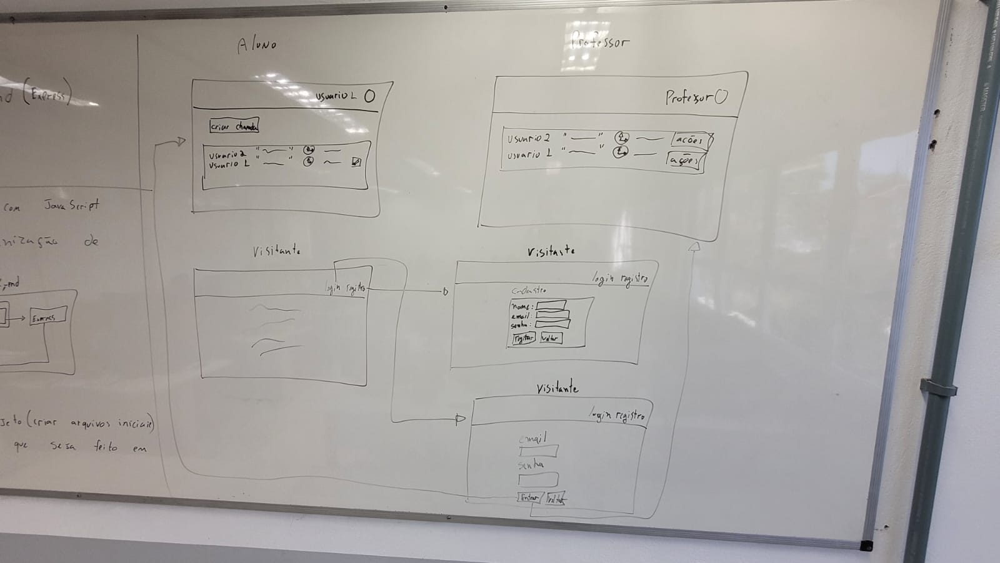

# AtendeAí — Fila de Ajuda em Sala

> **Objetivo**: organizar a fila de atendimento em aulas práticas para reduzir a espera, dar visibilidade da ordem e tornar o processo mais justo para todos.

## 📌 Sumário
1. [Problema](#1-problema)  
2. [Atores e Decisores](#2-atores-e-decisores-quem-usa--quem-decide)  
3. [Casos de Uso](#3-casos-de-uso-de-forma-simples)  
4. [Limites, Suposições e Plano B](#4-limites-e-suposições)  
5. [Hipóteses + Validação](#5-hipóteses--validação)  
6. [Fluxo Principal e Primeira Fatia](#6-fluxo-principal-e-primeira-fatia)  
7. [Esboços (Wireframes)](#7-esboços-de-algumas-telas-wireframes)  
8. [Tecnologias](#8-tecnologias)  
9. [Plano de Dados (Dia 0)](#9-plano-de-dados-dia-0--somente-itens-1–3)  
10. [Como rodar localmente (passo a passo)](#-como-rodar-localmente-passo-a-passo)  

---

## 1) Problema
- Em aulas práticas, **alunos esperam muito** para serem atendidos.  
- Há **filas confusas** e frustração. O professor **não vê ordem** nem **tempo de espera**.  
- **Objetivo inicial**: organizar a fila para reduzir a espera e garantir **justiça**.

## 2) Atores e Decisores (quem usa / quem decide)
- **Atores**: Visitantes (ainda não logados), **Alunos** e **Professores**  
- **Decisores/Apoiadores**: Professores; Coordenação do curso

## 3) Casos de uso (de forma simples)
- **Visitante**: Criar usuário e **logar** no sistema  
- **Aluno/Professor**: **Deslogar**; **Manter dados cadastrais**  
- **Professor**: **Manter** (listar, mostrar, inserir, editar, remover) **todos** os chamados  
- **Aluno**: **Manter seus próprios** chamados (listar, mostrar, inserir, editar, remover)

## 4) Limites e suposições
- **Limites**: entrega final até o fim da disciplina (ex.: **2025-11-30**); rodar no **navegador**; **sem serviços pagos**.  
- **Suposições**: internet no laboratório; navegador atualizado; acesso ao GitHub; **10 min** para teste rápido.  
- **Plano B**: sem internet → rodar local e salvar em **LocalStorage**; sem tempo do professor → testar com **3 colegas**.

## 5) Hipóteses + validação
- **Valor**: Se o aluno **vê sua posição na fila**, sente mais controle e conclui melhor a atividade.  
  - **Validação**: teste com **5 alunos**; sucesso se **≥ 4** abrirem/fecharem chamado **sem ajuda**.

- **Viabilidade**: Com app no navegador (**HTML/CSS/JS + armazenamento local**), criar e listar chamados **responde em até 1s** na maioria das vezes (ex.: 9/10).  
  - **Validação**: medir no protótipo com **30 ações**; meta: **≥ 27** em **1s** ou menos.

## 6) Fluxo principal e primeira fatia
**Fluxo principal**  
0) Aluno cria conta →  
1) Aluno faz login →  
2) Clica em **Criar chamado** e descreve a dúvida →  
3) Sistema **salva** e coloca **na fila** →  
4) Lista mostra **ordem** e **tempo desde a criação** →  
5) Professor faz login →  
6) Professor **encerra** o chamado.

**Primeira fatia vertical (MVP)**  
- Inclui **login simples**, **criar chamado**, **listar em ordem**.  
- **Critérios de aceite**:  
  - criar → aparece na lista **com horário**  
  - encerrar → **some** da lista ou aparece como **fechado**.

## 7) Esboços de algumas telas (wireframes)
Coloque aqui **links/imagens** dos rascunhos (papel, Figma, Excalidraw…).  
Exemplos de telas: **Login**, **Lista de chamados**, **Novo chamado**, **Painel do professor**.  
```

```

## 8) Tecnologias

### 8.1 Navegador
- **Navegador**: HTML/CSS/JS/Bootstrap  
- **Armazenamento local**: **LocalStorage (apenas protótipo/MVP sem servidor)**  
- **Hospedagem (front estático)**: **GitHub Pages**

### 8.2 Front-end (app cliente)
- **Front-end**: React (evolução natural do protótipo)  
- **Hospedagem**: GitHub Pages (ou outra, conforme evolução)

### 8.3 Back-end (API/servidor)
- **Back-end (API)**: JavaScript com **Express**  
- **Banco de dados**: **PostgreSQL** (ou MySQL; neste README focamos em **Postgres**)  
- **Deploy do back-end**: a definir (Heroku/Render/Fly.io/VPS)

> 💡 Para **Dia 0**, você pode testar **sem servidor**, apenas com o **navegador** (LocalStorage).  
> Para **evolução**, use a **API Express + Postgres** já modelada abaixo.

---

## 9) Plano de Dados (Dia 0) — somente itens 1–3

### 9.1 Entidades
- **Usuario** — pessoa que usa o sistema (aluno/professor), autentica-se e pode abrir/gerenciar chamados.  
- **Chamado** — solicitação de ajuda criada por um usuário, com descrição do problema, estado (aberto/fechado) e metadados; pertence a um **Usuario** via `Usuarios_id`.

### 9.2 Campos por entidade

#### Usuarios
| Campo           | Tipo                          | Obrigatório | Exemplo            |
|-----------------|-------------------------------|-------------|--------------------|
| id              | número                        | sim         | 1                  |
| nome            | texto                         | sim         | "Ana Souza"        |
| email           | texto                         | sim (único) | "ana@exemplo.com"  |
| senha_hash      | texto                         | sim         | "$2a$10$..."       |
| papel           | número (0=aluno, 1=professor) | sim         | 0                  |
| dataCriacao     | data/hora                     | sim         | 2025-08-20 14:30   |
| dataAtualizacao | data/hora                     | sim         | 2025-08-20 15:10   |

#### Chamados
| Campo           | Tipo        | Obrigatório | Exemplo            |
|-----------------|-------------|-------------|--------------------|
| id              | número      | sim         | 2                  |
| Usuarios_id     | número (fk) | sim         | 1                  |
| texto           | texto       | sim         | "Erro ao compilar" |
| estado          | char        | sim         | 'a' \| 'f'         |
| urlImagem       | texto       | não         | '/img/icone.png'   |
| dataCriacao     | data/hora   | sim         | 2025-08-20 14:35   |
| dataAtualizacao | data/hora   | sim         | 2025-08-20 14:50   |


### 9.3 Relações entre entidades
- Um **Usuario** tem muitos **Chamados**. (1→N)  
- Um **Chamado** pertence a um **Usuario**. (N→1)  
  - *(FK: `Chamados.Usuarios_id` → `Usuarios.id`)*

### 9.4 Modelagem do banco de dados no POSTGRES

```sql

SET client_encoding = 'UTF8';

CREATE TABLE IF NOT EXISTS "Usuarios" (
  "id"                SERIAL       PRIMARY KEY,
  "nome"              VARCHAR(255) NOT NULL,
  "email"             VARCHAR(255) NOT NULL UNIQUE,
  "senha_hash"        VARCHAR(255) NOT NULL,
  "papel"             SMALLINT     NOT NULL CHECK ("papel" IN (0,1)),  -- 0=aluno, 1=professor
  "data_criacao"      TIMESTAMP    NOT NULL DEFAULT now(),
  "data_atualizacao"  TIMESTAMP    NOT NULL DEFAULT now()
);

CREATE TABLE IF NOT EXISTS "Chamados" (
  "id"                SERIAL       PRIMARY KEY,
  "Usuarios_id"       INTEGER      NOT NULL REFERENCES "Usuarios"("id"),
  "texto"             VARCHAR(255) NOT NULL,
  "estado"            CHAR(1)      NOT NULL CHECK ("estado" IN ('a','f')), -- a=aberto, f=fechado
  "urlImagem"         VARCHAR(255),
  "data_criacao"      TIMESTAMP    NOT NULL DEFAULT now(),
  "data_atualizacao"  TIMESTAMP    NOT NULL DEFAULT now()
);

INSERT INTO "Usuarios" ("nome", "email", "senha_hash", "papel") VALUES
('Usuário',                'user@user.com.br',             '$2b$12$hOa7C35BZpDh7kJYoCld9YbLRMsvIkVzvr3LMBDHT46/Kpx7/aEzW', 0),
('Admin',                  'admin@admin.com.br',           '$2b$12$uBy.SQ6EAxn/o/clzQHi.ydZM.v4sM78Rnd/DgwpLyGhkQltSy6n0', 1),
('Alice Silva',            'alice@exemplo.com.br',         '$2b$12$Bnqzpx4w6TaRk8ck5bHtrVmtKV/OmjJ/qWWqBPmKhSZ0aSgKvSOAj', 0),
('Bruno Lima',             'bruno@exemplo.com.br',         '$2b$12$lsvj7q7QCfCriYUh/UeagGUVtGiYCwMat4J5bnP.u7rb9hjp55rdL', 0),
('Carla Ferreira',         'carla.ferreira@exemplo.com.br','$2b$12$k7mmguOilastEwMXekVTw3v5Vt/2JGG53GmVocr0i7ZhlkFKrde1M', 1),
('Diego Santos',           'diego@exemplo.com.br',         '$2b$12$Ru95WQEgzFqBOfyAG34/6Nppels6CUKoe1ma7urinZiZLQbNCZEj9', 0),
('Eduarda Costa',          'eduarda@exemplo.com.br',       '$2b$12$4NrPZt6yNJEPQO2ApaF04kD7CY.LV9XWRQTBPF6KwSE39YcChbBKF', 0),
('Felipe Almeida',         'felipe@exemplo.com.br',        '$2b$12$XpRkEBpxXukNijvqNnyy.SQxJ3.olhNnK.1aT.Yl5d2JYp89dGINg', 0),
('Giselle Rocha',          'giselle@exemplo.com.br',       '$2b$12$VTqKt4ERLTmLRCGrJIfGVOwmGcEir9KDq7G5RWrnYRlBvHfw82jh7', 1),
('Henrique Martins',       'henrique@exemplo.com.br',      '$2b$12$hzzNU5mPWkgYoHe1RD0uYYTibS8lO/XXI1aVoYjEJ1zAw9lPQOUEJ', 0),
('Isabela Nunes',          'isabela@exemplo.com',          '$2b$12$GXQT1tXZD46SovxYIt8Gav6stqg/05PleFbmH.J3F2chAuiCVgcfz', 0),
('Joao Pedro Ramos',       'joao.ramos@exemplo.com.br',    '$2b$12$oXKiRh8ktUFaMTstKX/cCfDUAUT2SepSNwRdWtUenkwz1IwFL6V6b', 0),
('Karen Oliveira',         'karen@exemplo.com.br',         '$2b$12$9x2GHtGECKzuQCJS65.1klPkri2xpNTvbEZLDlrVsvVBLZp4cnKlc', 0),
('Luiz Fernando Teixeira', 'luiz.teixeira@exemplo.com.br', '$2b$12$woeItTdOln/h4lP8Dc65k1XqFI5fOlSADwHsQk/T50ES8K9I0dpn4', 1);

INSERT INTO "Chamados" ("Usuarios_id", "texto", "estado") VALUES
(1,  'Preciso de ajuda com JS', 'a'),
(1,  'Erro ao instalar dependências no npm',          'a'),
(2,  'Dúvida sobre rotas no Express',                 'f'),
(3,  'Como organizar a fila por tempo de criação?',   'a'),
(4,  'Falha ao conectar no banco Postgres',           'a'),
(5,  'Revisar critérios de encerramento de chamado',  'f'),
(6,  'Problema com CORS no navegador',                'a'),
(7,  'Como validar preço >= 0 no backend?',           'a'),
(8,  'PUT vs PATCH: quando usar cada um?',            'f'),
(9,  'Padronizar mensagens de erro da API',           'a'),
(10, 'Timeout ao fazer fetch no front',               'a');

INSERT INTO "Chamados" ("Usuarios_id", "texto", "estado", "urlImagem") VALUES
(11, 'Layout da lista não carrega no CSS',            'a', '/img/wireframe-lista.png'),
(12, 'Bug ao atualizar produto (PUT)',                'f', '/img/bug-put.png'),
(13, 'Imagem não aparece no README',                  'a', '/img/readme-img.png'),
(14, 'Organização das rotas em /api/produtos',        'a', '/img/rotas.png'),
(3,  'Ícone quebra em telas pequenas',                'f', '/img/icone-responsivo.png'),
(4,  'Mensagem de validação pouco clara',             'a', '/img/validacao-msg.png'),
(5,  'Dúvida sobre COALESCE no SQL',                  'a', '/img/sql-coalesce.png'),
(6,  'Diferença entre 200 e 201 no retorno',          'f', '/img/http-status.png');

```

---

## 🔧 Como rodar localmente (passo a passo)

### 1) Pré-requisitos
- **Node.js** instalado (versão LTS recomendada)  
- **PostgreSQL** rodando localmente

### 2) Criar arquivo `.env` na raiz do projeto
```env
#PORTA DO SERVIDOR DO EXPRESS
PORT=3000

# CONFIGURAÇÃO POSTGRES
DB_HOST=localhost
DB_PORT=5432
DB_USER=postgres
DB_PASSWORD=aluno
DB_DATABASE=chamados_api_db
PG_DATABASE_ADMIN=postgres
DB_DATABASE_ADMIN_PASSWORD=aluno

# CAMINHO PARA O SQL DO BANCO EM POSTGRES
DB_DATABASE_FILE_PATH=./src/database/banco.sql
```

### 3) Instalar dependências e iniciar
```bash
npm install
npm run dev   # ou: node server.js / npm start (conforme seu package.json)
```

### 4) Criar as tabelas
- Abra o **psql** (ou pgAdmin) e execute o script SQL da seção **9.4**.  
- Ajuste usuário/senha/porta conforme o seu Postgres.

---
